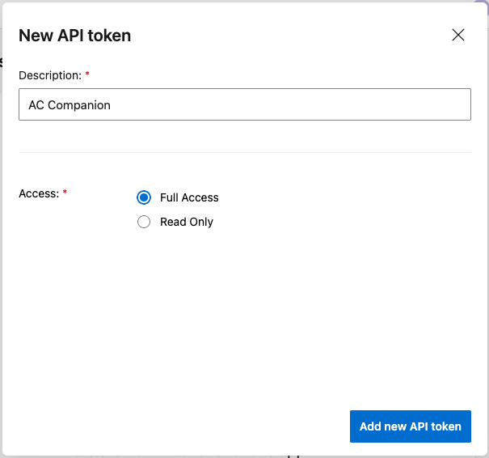

# Tauri AppCenter Companion

[](https://github.com/zenoxs/tauri-appcenter-companion/actions/workflows/publish.yml)
[](https://github.com/zenoxs/tauri-appcenter-companion/releases/latest)
[](https://github.com/zenoxs/tauri-appcenter-companion/releases/latest)
[](https://github.com/zenoxs/tauri-appcenter-companion/blob/main/LICENSE)

<p align="center">
  
</p>

A companion app written with **React** and **Tauri** to help manage your applications on appcenter. This idea is to provide an easy way to group your appcenter's applications into a single view, that way you can easily build all your related application with one click and follow the progress and status.


## Features

- Consult the build status (in live) of all your applications
- Start / Cancel the build of your app
- Start / Cancel the build of all your apps in bundled application

## How to use it ?

### Add token api

First install the application from the [release page](https://github.com/zenoxs/tauri-appcenter-companion/releases/latest):

- **AC.Companion_x.x.x_x64.dmg** for intel MacOS
- **AC.Companion_x.x.x_x64_en-US.msi** for Windows
- **ac-companion_x.x.x_amd64.AppImage** for Linux
- **ac-companion_x.x.x_amd64.deb** for Debian\* system

First you need to create an API Token from your Appcenter account. This can be done in 2 ways:

- From your Appcenter [account settings](https://appcenter.ms/settings/apitokens), **/!\\ remark** if you do so thee generated token will have access to all your apps.
- From the settings of your app : https://appcenter.ms/orgs/{owner}/apps/{app-name}/settings/apitokens



Then copy the generated token, open the "API Tokens" settings from the app and add a new token.

### Create a bundled application

_What is a bundled application ?_
A bundled application is a logical representation of multiple appcenter's applications. If you relate on a single base code framework and you want to build, for example, your Android and iOS application you need to go each time to the detail of th application to launch and track the build. With a bundled application you can manage all your applications's build in a single view.

**To create a bundled application** you need to navigate to the **Applications** page and click on the **Add** button. Then the app will fetch all your registered token-based apps with their configured branches. You can select which branches will compose your bundled application and the name of your bundled application. Then press the **Save** button to create your bundled application and voilà.

## Confidentiality & Security

##

**Q:** Do AC Companion can acccess to my appcenter's account?

**A:** No, the application is designed to be a serverless app. All your data is stored in your local machine. AC Companion only use the [App Center API](https://openapi.appcenter.ms/) to communicate with your appcenter's account.

##

---

## Development

### Install

```shell
yarn install
```

### Start app in dev

```shell
yarn run tauri dev
```
